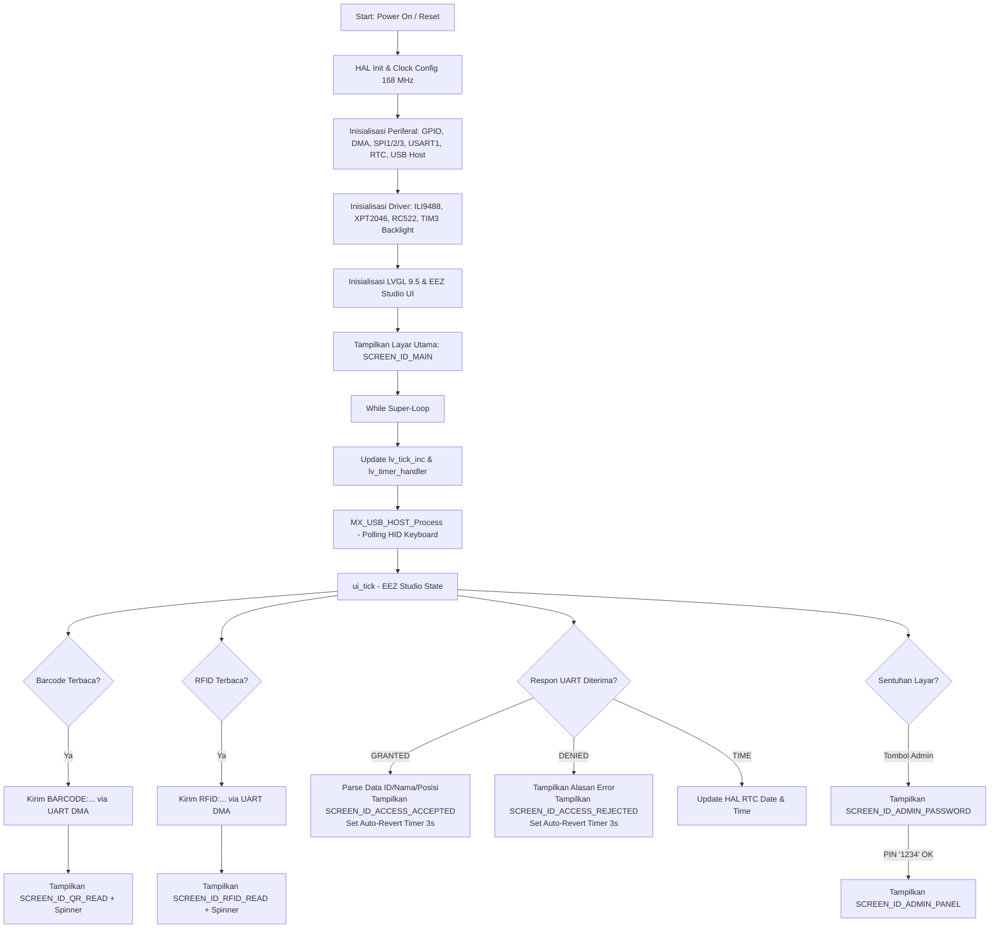

# Sistem Kontrol Akses STM32F446RE (Display ILI9488, LVGL v9, RFID RC522, & Barcode USB Host)

Sistem ini merupakan perangkat **Access Control & Attendance Terminal** modern berbasis mikrokontroler **STM32F446RET6** (ARM Cortex-M4 @ 168 MHz). Sistem menggabungkan antarmuka grafis tingkat lanjut menggunakan **LVGL v9.5.0** yang didesain via **EEZ Studio**, layar TFT LCD **ILI9488** (480x320) dengan akselerasi **DMA**, layar sentuh **XPT2046**, pembaca kartu **RFID RC522**, pemindai **Barcode/QR Code via USB Host HID**, serta komunikasi jaringan via **USART1 (DMA/IT)** ke gateway eksternal (seperti ESP32/ESP8266/PC Server).

---

## 1. Fitur Utama Sistem

- **GUI Modern Berbasis LVGL v9 & EEZ Studio:**
  - Rendering grafis berbasis objek dengan memori efisien (*partial buffer rendering* 1/10 layar, format warna RGB888, akselerasi transfer SPI DMA).
  - Tampilan UI terstruktur: Layar Standby, Deteksi RFID, Deteksi Barcode/QR, Akses Diterima (nama, ID, posisi), Akses Ditolak (pesan error), dan Keypad PIN Admin.
  - Transisi layar otomatis non-blocking (*timer-based auto-revert* 3 detik) kembali ke layar utama setelah validasi akses.

- **Layar Sentuh (Touch Screen) Interaktif:**
  - IC pengontrol sentuh resistif **XPT2046** yang dihubungkan ke subsistem input pointer LVGL.
  - Keypad virtual matriks numerik untuk otentikasi PIN administrator (Default: `1234`).

- **Dual Authentication Scanner:**
  - **RFID Reader (MFRC522):** Pembaca kartu pintar frekuensi 13.56 MHz (Mifare 1K/4K/Ultralight) via SPI3 dengan interval polling non-blocking.
  - **USB Host Barcode / 2D QR Scanner:** Membaca scanner USB standar melalui antarmuka USB OTG FS (Full Speed) profil HID Keyboard. Menangkap data ASCII seketika hingga karakter *Enter* (`\r` atau `\n`).

- **Komunikasi Jaringan Serial (USART1):**
  - Menggunakan DMA untuk pengiriman data (TX) dan Interrupt untuk penerimaan data (RX) pada baudrate 115200 bps.
  - Protokol berbasis teks dengan parser *delimiter pipe* (`|`) untuk penguraian identitas pengguna secara fleksibel.

- **Real-Time Clock (RTC) Internal & Sinkronisasi Jaringan:**
  - Menyimpan waktu riil sistem menggunakan LSI/LSE clock source.
  - Mendukung sinkronisasi waktu jaringan melalui pesan serial `TIME:YYYY-MM-DD HH:MM:SS\n`.

- **Penyimpanan Lokal (SDIO / FatFS Ready):**
  - Periferal SDIO DMA dan middleware FatFS terpasang untuk kebutuhan pencatatan log transaksi offline (*offline audit log*).

---

## 2. Arsitektur Perangkat Keras & Pinout

### Spesifikasi Hardware
| Komponen | Spesifikasi / Tipe | Antarmuka ke STM32 |
| :--- | :--- | :--- |
| **MCU** | STM32F446RET6 (ARM Cortex-M4, 512KB Flash, 128KB SRAM, 168 MHz) | Internal On-Board |
| **Display** | 3.5" / 4.0" TFT LCD ILI9488 (Resolusi 480x320, 262K/16M RGB888) | SPI1 (42 MHz) + DMA2 Stream 3 |
| **Backlight Display** | Kontrol Kecerahan Layar (PWM 50% duty cycle) | TIM3 Channel 3 (PB0) |
| **Touchscreen** | Kontroler Layar Sentuh XPT2046 | SPI2 (1.31 MHz) + IRQ Interrupt (PC6) |
| **RFID Reader** | Modul NXP MFRC522 (13.56 MHz) | SPI3 (5.25 MHz) + CS/RST GPIO |
| **Barcode Scanner** | USB Barcode/QR Scanner (HID POS/Keyboard mode) | USB OTG FS (PA11, PA12, PC7) |
| **Network Gateway** | ESP32 / ESP8266 / PC Server / Modul IoT | USART1 (PA9 TX, PA10 RX) |
| **Penyimpanan** | Modul MicroSD Card | SDIO 1-bit / 4-bit + DMA2 Stream 6 |

---

### Tabel Pemetaan Pin Lengkap (Pinout Mapping)

| Pin STM32 | Nama Sinyal Periferal | Label / Modul | Keterangan Fungsi |
| :--- | :--- | :--- | :--- |
| **PA4** | `GPIO_Output` | `SPI1_CS` | Chip Select Layar TFT ILI9488 |
| **PA5** | `SPI1_SCK` | `LCD_SCK` | SPI1 Clock (42 MHz) ke Display |
| **PA6** | `SPI1_MISO` | `LCD_MISO` | SPI1 Data Masuk dari Display |
| **PA7** | `SPI1_MOSI` | `LCD_MOSI` | SPI1 Data Keluar ke Display |
| **PC4** | `GPIO_Output` | `SPI1_RST` | Reset Pin Layar TFT ILI9488 |
| **PC5** | `GPIO_Output` | `SPI1_DC` | Data / Command Selector ILI9488 |
| **PB0** | `TIM3_CH3` | `LCD_BL` | Backlight Display PWM (Brightness Control) |
| **PB12** | `GPIO_Output` | `SPI2_CS` | Chip Select Kontroler Sentuh XPT2046 |
| **PB13** | `SPI2_SCK` | `TOUCH_SCK` | SPI2 Clock ke XPT2046 |
| **PB14** | `SPI2_MISO` | `TOUCH_MISO` | SPI2 Data Koordinat dari XPT2046 |
| **PB15** | `SPI2_MOSI` | `TOUCH_MOSI` | SPI2 Perintah ke XPT2046 |
| **PC6** | `GPIO_EXTI6` | `SPI2_IRQ` | Touch Interrupt Pin (Active LOW saat layar ditekan) |
| **PB6** | `GPIO_Output` | `SPI3_CS` | Chip Select Reader RFID RC522 |
| **PB7** | `GPIO_Output` | `SPI3_RST` | Reset Pin Reader RFID RC522 |
| **PB3** | `SPI3_SCK` | `RC522_SCK` | SPI3 Clock ke RC522 |
| **PB4** | `SPI3_MISO` | `RC522_MISO` | SPI3 Data dari RC522 |
| **PB5** | `SPI3_MOSI` | `RC522_MOSI` | SPI3 Data ke RC522 |
| **PA11** | `USB_OTG_FS_DM` | `USB_DM` | USB Data Minus (D-) ke Port Barcode Scanner |
| **PA12** | `USB_OTG_FS_DP` | `USB_DP` | USB Data Plus (D+) ke Port Barcode Scanner |
| **PC7** | `GPIO_Output` | `USB_POWER` | Saklar Daya VBUS 5V Pemindai USB |
| **PA9** | `USART1_TX` | `UART_TX` | Transmit Serial ke Modul Jaringan / ESP32 |
| **PA10** | `USART1_RX` | `UART_RX` | Receive Serial dari Modul Jaringan / ESP32 |
| **PC8 - PC11** | `SDIO_D0 - SDIO_D3` | `SD_DAT0-3` | Data Jalur SD Card MicroSD |
| **PC12** | `SDIO_CK` | `SD_CLK` | Clock SD Card |
| **PD2** | `SDIO_CMD` | `SD_CMD` | Command Line SD Card |
| **PA8** | `GPIO_Input` | `SDIO_DET` | Pin Deteksi Fisik Keberadaan Kartu MicroSD |
| **PB2** | `GPIO_Output` | `USER_LED` | LED Indikator Status pada Papan |
| **PC13** | `GPIO_EXTI13` | `USER_BTN` | Tombol Pengguna (User Button Nucleo) |

---

## 3. Arsitektur Perangkat Lunak & Alur Kerja

Program dirancang dengan pola *Super Loop* non-blocking yang mengeksekusi *Engine* grafis LVGL, *driver* perangkat input, dan proses USB Host secara teratur.



### Penanganan Transaksi Non-Blocking:
- **Transmisi Cepat:** Pengiriman ID kartu atau data barcode ke server langsung dieksekusi via `HAL_UART_Transmit_DMA`, sehingga tidak membebani pemrosesan layar.
- **USB Host Protection:** Pada saat driver display menunggu DMA transfer (`ILI9488_TransmitDMA`), fungsi `MX_USB_HOST_Process()` tetap dipanggil agar paket USB HID dari scanner tidak hilang/drop (*zero dropped scan events*).
- **Auto Revert Screen:** Menggunakan objek `lv_timer` (`revert_to_main_cb`) berdurasi 3000 ms dengan eksekusi 1 kali (`repeat_count = 1`), menjamin transisi kembali ke layar utama tanpa menggunakan fungsi pemblokir seperti `HAL_Delay()`.

---

## 4. Protokol Komunikasi Jaringan (UART USART1)

Format pesan antar STM32 dan Gateway/Server dirancang ringkas menggunakan format string berakhiran baris baru (`\n` atau `\r\n`).

### a. Dari STM32 ke Gateway/Server (TX)

| Perintah | Format Payload | Contoh Data | Deskripsi |
| :--- | :--- | :--- | :--- |
| **Kartu RFID Terbaca** | `RFID:<UID_HEX>\n` | `RFID:A1B2C3D4\n` | Mengirimkan 4-byte UID kartu RFID dalam representasi heksadesimal huruf besar. |
| **Barcode/QR Terbaca** | `BARCODE:<STRING_DATA>\n` | `BARCODE:EMP-2026-0042\n` | Mengirimkan hasil pembacaan teks dari scanner USB barcode. |
| **Permintaan Waktu** | `CMD:SYNC_TIME\n` | `CMD:SYNC_TIME\n` | Meminta waktu jaringan terkini dari server NTP melalui gateway. |

### b. Dari Gateway/Server ke STM32 (RX)

| Respon | Format Payload | Contoh Data | Respon Sistem STM32 |
| :--- | :--- | :--- | :--- |
| **Akses Diterima** | `GRANTED:<ID>\|<NAMA>\|<POSISI>\n` | `GRANTED:1024\|Ahmad Yuu\|Lead Engineer\n` | STM32 memisahkan data dengan *strtok* pipe (`\|`), mengisi label pada `SCREEN_ID_ACCESS_ACCEPTED`, dan kembali ke standby setelah 3 detik. |
| **Akses Ditolak** | `DENIED:<ALASAN_PENOLAKAN>\n` | `DENIED:Kartu Tidak Aktif / Expired\n` | Menampilkan pesan kesalahan di `SCREEN_ID_ACCESS_REJECTED`, lalu kembali ke standby setelah 3 detik. |
| **Pembaruan Waktu** | `TIME:YYYY-MM-DD HH:MM:SS\n` | `TIME:2026-09-17 17:45:00\n` | Mengurai tahun, bulan, hari, jam, menit, detik dan memperbarui waktu pada RTC internal STM32. |
| **Kegagalan Waktu** | `TIME_ERR:<PESAN_ERROR>\n` | `TIME_ERR:NTP Server Unreachable\n` | Menandai flag kegagalan sinkronisasi waktu jaringan. |

---

## 5. Struktur Layar GUI (EEZ Studio & LVGL)

Layar dikelola melalui enumerasi `ScreensEnum` pada [screens.h](file:///Core/Src/eez/screens.h):

1. **`SCREEN_ID_MAIN` (Layar Standby / Utama):**
   - Menampilkan teks status instruksi: *"Silahkan Scan Barcode atau RFID"*.
   - Tombol sentuh **"Admin"** di posisi kanan bawah (koordinat x: 367, y: 273).
2. **`SCREEN_ID_ADMIN_PASSWORD` (Keypad Input PIN):**
   - Keypad virtual berbasis matriks tombol (`lv_buttonmatrix`) dengan tombol: `1, 2, 3, 4, 5, 6, 7, 8, 9, 0, DEL, OK`.
   - Area teks sandi (`objects.textarea_input_password`). Password valid: `1234`.
3. **`SCREEN_ID_ADMIN_PANEL` (Panel Administrator):**
   - Layar khusus administrasi perangkat setelah verifikasi kata sandi sukses.
4. **`SCREEN_ID_QR_READ` (Layar Deteksi Barcode/QR):**
   - Menampilkan header *"QR Code Terdeteksi"*.
   - Label teks hasil scan (`objects.id_qrcode`).
   - Animasi pemuatan melingkar (`objects.spinner_loading_1`) saat menunggu jawaban verifikasi dari server.
5. **`SCREEN_ID_RFID_READ` (Layar Deteksi Kartu RFID):**
   - Menampilkan header *"Rfid Terdeteksi"*.
   - Label teks UID kartu (`objects.id_rfid`).
   - Animasi pemuatan melingkar (`objects.spinner_loading`) saat otentikasi berlangsung.
6. **`SCREEN_ID_ACCESS_ACCEPTED` (Layar Akses Sukses):**
   - Menampilkan judul hijau *"Akses Diterima!"*.
   - Menampilkan rincian data karyawan/pengguna:
     - **ID:** `objects.id_user`
     - **Nama:** `objects.nama_user`
     - **Posisi/Divisi:** `objects.posisi_user`
7. **`SCREEN_ID_ACCESS_REJECTED` (Layar Akses Gagal):**
   - Menampilkan judul merah *"Akses Ditolak"*.
   - Menampilkan alasan penolakan pada label `objects.error_reason`.

---

## 6. Struktur Direktori Proyek

```plaintext
STM32F446RE-display-rfid-barcode/
├── Core/
│   ├── Inc/
│   │   ├── main.h               # Definisi GPIO Pinout & peripheral handle
│   │   ├── ili9488.h            # Header & konfigurasi display driver ILI9488
│   │   ├── xpt2046.h            # Header touch controller XPT2046
│   │   ├── rc522.h              # Register & API modul RFID RC522
│   │   ├── lv_conf.h            # Konfigurasi fitur & buffer LVGL v9
│   │   └── lvgl.h               # LVGL main API include
│   └── Src/
│       ├── main.c               # Program utama, alur State/Event, & loop pemrosesan
│       ├── ili9488.c            # Driver ILI9488 (SPI DMA & LVGL flush callback)
│       ├── xpt2046.c            # Driver XPT2046 (Touch ADC read, kalibrasi, debouncing)
│       ├── rc522.c              # Driver MFRC522 SPI
│       ├── stm32f4xx_hal_msp.c  # Inisialisasi clock, DMA, dan pinout tingkat rendah
│       ├── stm32f4xx_it.c       # Rutin layanan interupsi (ISR)
│       └── eez/                 # Hasil generate UI dari EEZ Studio
│           ├── ui.c / ui.h      # Inisialisasi antarmuka EEZ
│           ├── screens.c / .h   # Definisi hierarki widget dan objek layar
│           └── actions.h        # Callback tombol dan event handler layar sentuh
├── Middlewares/
│   ├── Third_Party/FatFs/       # Middleware sistem berkas MicroSD
│   └── ST/STM32_USB_Host_Library/ # Stack USB Host untuk HID Keyboard
├── USB_HOST/
│   ├── App/usb_host.c           # Inisialisasi dan callback core USB Host
│   └── Target/usbh_conf.c       # Konfigurasi low-level hardware USB OTG FS
└── readme.md                    # Dokumentasi komprehensif sistem
```

---

## 7. Panduan Penggunaan & Pengujian

### Prasyarat Pengembangan
1. **STM32CubeIDE** (versi 1.14.0 atau lebih baru) dengan toolchain GNU Arm Embedded.
2. Board mikrokontroler **ST Nucleo-F446RE** atau board custom STM32F446RE.
3. Power supply 5V yang cukup (USB Barcode scanner dan LCD ILI9488 membutuhkan arus stabil minimal 500mA - 1A).
4. USB-to-UART converter (CP2102, FTDI, atau CH340) untuk menghubungkan pin USART1 (`PA9`/`PA10`) ke laptop jika menguji tanpa modul ESP32.

### Kompilasi dan Flash
1. Buka workspace di **STM32CubeIDE**.
2. Pilih menu **Project > Clean...** lalu **Project > Build Project**.
3. Hubungkan board via kabel ST-Link USB.
4. Klik **Run** atau **Debug** untuk mengunggah firmware ke mikrokontroler.

### Contoh Simulasi Server via Terminal Serial (Baudrate 115200)
Gunakan aplikasi Serial Terminal (seperti PuTTY, Tera Term, atau Serial Monitor VSCode):
1. **Saat Kartu RFID Ditempelkan:**
   - STM32 mengirim:
     ```text
     RFID:3A4B5C6D
     ```
   - Balas dengan string penerimaan akses:
     ```text
     GRANTED:EMP001|Budi Santoso|Software Engineer
     ```
   - Layar akan menampilkan kartu diterima beserta data ID, Nama, dan Posisi selama 3 detik.
2. **Saat Barcode Ditolak:**
   - STM32 mengirim:
     ```text
     BARCODE:UNKNOWN-TAG-123
     ```
   - Balas dengan string penolakan:
     ```text
     DENIED:ID Barcode Belum Terdaftar
     ```
   - Layar akan menampilkan silang merah dengan tulisan *Alasan : ID Barcode Belum Terdaftar*.
3. **Mengatur Waktu RTC Sistem:**
   - Kirimkan string:
     ```text
     TIME:2026-09-17 18:00:00
     ```
   - Jam pada sistem RTC mikrokontroler akan langsung sinkron.

---

## 8. Rencana Pengembangan Selanjutnya (Roadmap)

1. **Penyimpanan Log Transaksi Luring (Offline Logging FatFS):**
   - Menyimpan rekaman riwayat tap kartu dan scan barcode ke file `.csv` di MicroSD saat jaringan terputus (*store-and-forward mechanism*).
2. **Koneksi Mandiri MQTT/HTTP:**
   - Menjalankan AT-Command langsung dari STM32 ke modem WiFi/GSM untuk koneksi langsung ke backend cloud tanpa mikrokontroler perantara.
3. **Database Kredensial Lokal:**
   - Menyimpan *hash* atau salinan UID offline pada memori Flash internal STM32 sehingga verifikasi akses dapat berlangsung instan tanpa latency jaringan.
