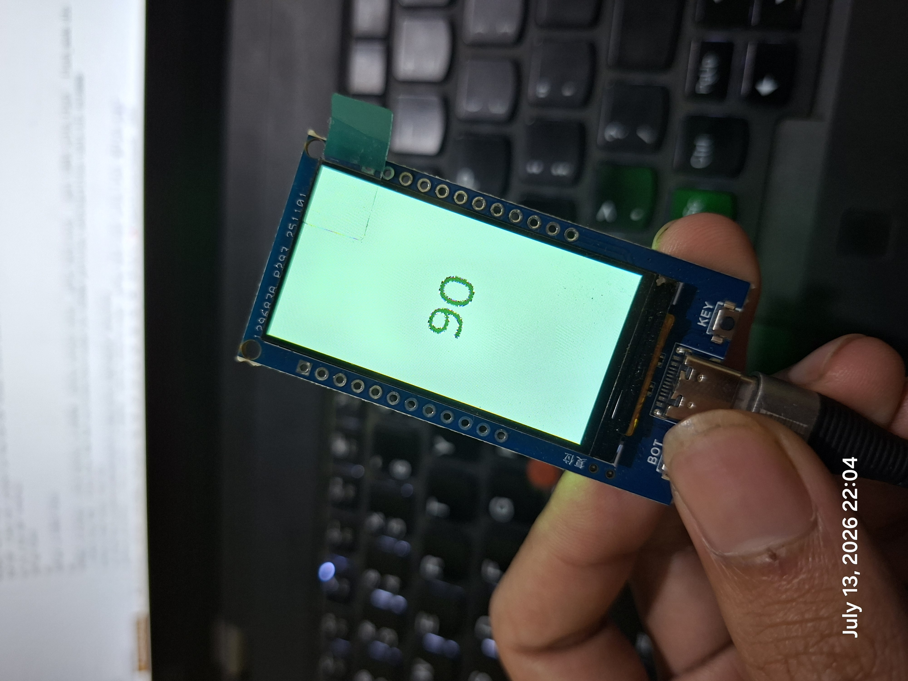
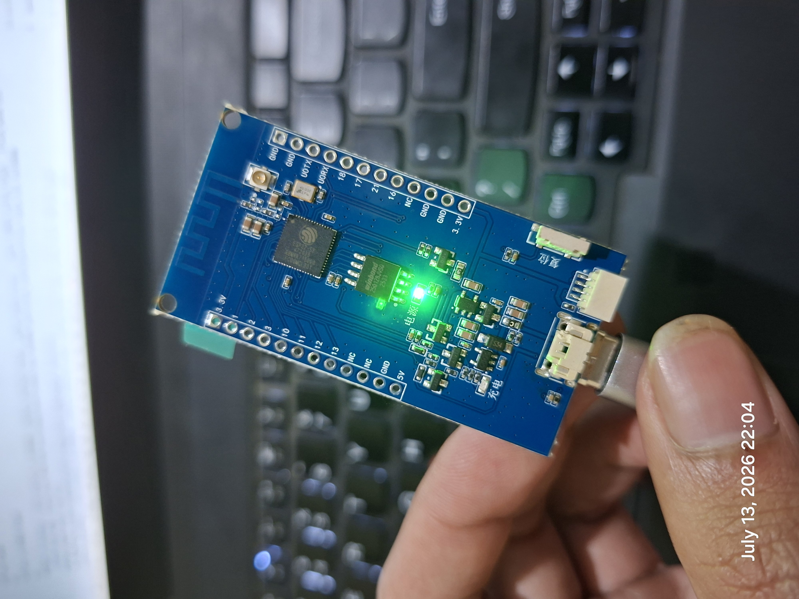

# ESP32-S3 ST7789 LVGL Example

Proyek ini adalah contoh aplikasi untuk ESP32-S3 yang menggunakan antarmuka SPI untuk mengontrol layar LCD dengan driver ST7789 dan menggunakan **LVGL** (Light and Versatile Graphics Library) untuk merender elemen antarmuka pengguna (UI). 

Aplikasi ini menggunakan layar LCD untuk menampilkan UID dari tag RFID yang dipindai menggunakan modul RC522. Pada saat awal atau *standby*, layar akan menampilkan teks "Scan RFID...", dan ketika ada kartu/tag RFID di dekat modul, layar akan memunculkan ID tag tersebut.

## Screenshot
<p align="center">
  
  
</p>

## Fitur
* **Layar ST7789 via SPI**: Resolusi layar diatur menjadi **170 x 320** piksel.
* **LVGL Porting**: Menggunakan komponen `esp_lvgl_port` untuk mempermudah integrasi LVGL dengan driver layar dari ESP-IDF (`esp_lcd`).
* **Pemindaian RFID**: Menggunakan library RC522 melalui koneksi SPI terpisah untuk membaca *Unique ID* (UID) dari kartu/tag RFID.
* **Font Besar**: Menggunakan *font* bawaan LVGL yang besar (`lv_font_montserrat_48`) untuk menonjolkan angka pada layar.

## Kebutuhan Perangkat Keras (Hardware)

* Sebuah *development board* ESP32-S3.
* Sebuah layar LCD dengan driver **ST7789** (resolusi 170x320 atau sejenis).
* Sebuah modul pembaca RFID RC522 (bekerja pada tegangan 3.3V).

### Konfigurasi Pin (Pinout)

Berikut adalah konfigurasi pin default yang digunakan dalam program ini (bisa dilihat dan diubah pada file `main/main.c`):

| Perangkat | Fungsi Pin            | Pin GPIO (ESP32-S3) |
|-----------|-----------------------|---------------------|
| Layar     | Reset Layar (RST)     | GPIO 5              |
| Layar     | Chip Select (CS)      | GPIO 6              |
| Layar     | Data / Command (DC)   | GPIO 7              |
| Layar     | SPI Clock (SCLK)      | GPIO 8              |
| Layar     | SPI Data (MOSI)       | GPIO 9              |
| Layar     | Backlight Control (BL)| GPIO 38             |
| **RC522** | **SDA / CS**          | **GPIO 10**         |
| **RC522** | **SCK / SCLK**        | **GPIO 12**         |
| **RC522** | **MOSI**              | **GPIO 11**         |
| **RC522** | **MISO**              | **GPIO 13**         |
| **RC522** | **RST**               | **GPIO 1**          |
| Tombol     | Tombol 1       | GPIO 0              |
| Tombol      | Tombol 2| GPIO 14             |

*Catatan: Konfigurasi layar mendefinisikan backlight aktif HIGH (`gpio_set_level(PIN_NUM_BK_LIGHT, 1)`).*

## Kebutuhan Perangkat Lunak (Software)

* **ESP-IDF** (Contoh ini dibuat dan diuji menggunakan ESP-IDF v6.0.1, tetapi juga mendukung v5.x).
* **Komponen**: `lvgl/lvgl` (v8.3.x) dan `espressif/esp_lvgl_port` via *ESP Component Registry* (sudah dikonfigurasi pada `main/idf_component.yml`).

## Cara Penggunaan

### 1. Konfigurasi Proyek

Pastikan *target* chip Anda sudah diatur ke `esp32s3`:
```bash
idf.py set-target esp32s3
```

*(Opsional)* Jika Anda ingin memastikan *font* sudah diaktifkan secara manual melalui Menuconfig:
```bash
idf.py menuconfig
```
Arahkan ke `Component config` > `LVGL configuration` > `Font usage` dan pastikan `Montserrat 48` sudah diaktifkan. (Sebagai catatan, *font* ini sudah diaktifkan secara otomatis melalui penambahan di file `sdkconfig.defaults`).

### 2. Build dan Flash

Jalankan perintah berikut untuk mengkompilasi program, mengunggahnya (*flash*) ke ESP32-S3, dan membuka serial monitor:

```bash
idf.py build
idf.py -p (PORT_ANDA) flash monitor
```
*(Contoh: `idf.py -p COM3 flash monitor` di Windows)*

Untuk keluar dari serial monitor, tekan kombinasi `Ctrl+]`.

## Cara Kerja Program (`main.c`)

1. **Inisialisasi GPIO**: 
   Mengaktifkan pin *backlight* layar sebagai *output* (menyala) dan kedua pin tombol sebagai *input* dengan *pull-up* internal.
2. **Inisialisasi SPI Bus & Panel IO**:
   Menggunakan `spi_bus_initialize` dan `esp_lcd_new_panel_io_spi` untuk menyiapkan komunikasi SPI ke driver ST7789.
3. **Inisialisasi Panel Driver (ST7789)**:
   Mendaftarkan driver layar dengan `esp_lcd_new_panel_st7789`.
   Terdapat perintah `esp_lcd_panel_set_gap(panel_handle, 35, 0)` yang menambahkan *offset* sebesar 35 piksel di sumbu X (umum diperlukan pada layar 170x320 yang tidak memanfaatkan penuh VRAM 240x320 ST7789).
4. **LVGL Porting**:
   Menjalankan inisialisasi awal LVGL melalui `lvgl_port_init()` dan mendaftarkan *display* dengan `lvgl_port_add_disp()`. Secara default, LVGL berjalan dalam *task* khusus di belakang layar.
5. **Pembuatan UI (Label LVGL)**:
   Mengunci akses LVGL menggunakan `lvgl_port_lock(0)`. Kemudian, program membuat teks awal "Scan RFID..." dengan *font* `lv_font_montserrat_48` di tengah layar, dan membukanya kembali.
6. **Inisialisasi RC522**:
   Melakukan setup *bus* SPI3 untuk komunikasi dengan modul RFID RC522 dan mendaftarkan *event handler* (`rc522_handler`).
7. **Main Loop dan Event Handler**:
   *Main loop* hanya berupa *delay*, sedangkan segala aktivitas pembacaan tag diurus secara asinkronus oleh *driver*. Ketika sebuah tag terdeteksi, *event* `RC522_EVENT_TAG_SCANNED` memicu pembaruan antarmuka LVGL untuk menampilkan UID dalam format angka.
