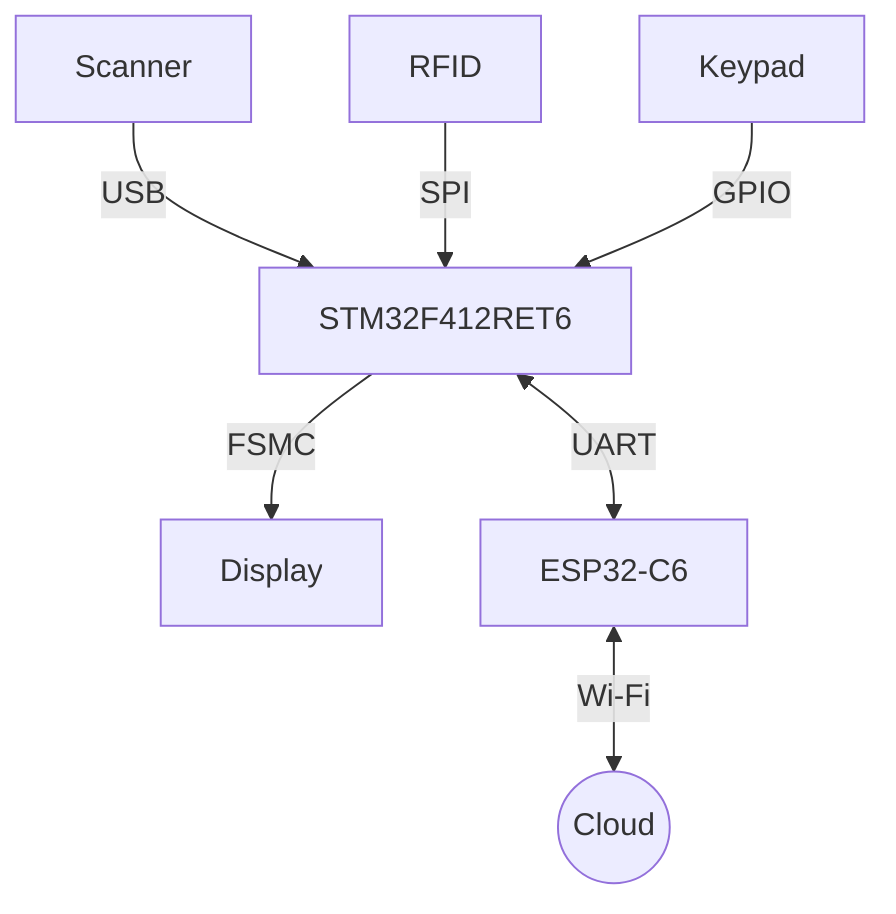

# Perancangan Sistem IoT Berbasis STM32F412RET6 (QR Code & RFID)

## 1. Gambaran Umum Sistem
Sistem ini merupakan perangkat IoT interaktif yang dirancang untuk keperluan identifikasi, akses kontrol, atau sistem transaksi cerdas. Sistem ini menggunakan **STM32F412RET6** sebagai otak komputasi utama karena kemampuannya yang mumpuni dalam menangani banyak periferal secara bersamaan (kecepatan komputasi memadai, kapasitas memori yang cukup, dan ketersediaan pin yang pas).

Sistem mampu menerima input multi-modal (QR Code/Barcode, RFID, dan input manual via keypad) serta memberikan *feedback* visual yang mulus melalui layar berkecepatan tinggi. Untuk terhubung dengan jaringan internet/cloud, sistem dibantu oleh mikrokontroler **ESP32-C6** sebagai ko-prosesor komunikasi.

## 2. Arsitektur Perangkat Keras (Hardware)

### 2.1. Unit Komputasi Utama: STM32F412RET6
*   **Peran Utama**: Mengendalikan seluruh logika operasional, memproses data dari semua sensor/input, merender antarmuka pengguna (UI) ke layar, dan mengatur komunikasi dengan ko-prosesor jaringan.
*   **Alasan Pemilihan**: Memiliki antarmuka USB Host (OTG), FSMC untuk kontroler layar eksternal, multiple SPI dan UART, serta resource komputasi (Cortex-M4) yang mampu menghandle layar, USB, dan komunikasi internet secara bersamaan.

### 2.2. Modul Konektivitas Internet: ESP32-C6
*   **Peran**: Bertindak sebagai modul Wi-Fi untuk menghubungkan sistem lokal ke internet (Cloud Server/Database IoT).
*   **Protokol Komunikasi**: ESP32-C6 akan berkomunikasi dengan STM32F412RET6 melalui antarmuka **UART** (atau SPI) menggunakan protokol serial khusus (AT Commands kustom atau SLIP) untuk mengirim dan menerima *payload* data (misal: MQTT, HTTP GET/POST).

### 2.3. Periferal Input (Identifikasi & Interaksi)
*   **USB Barcode / QR Code Scanner**:
    *   **Antarmuka**: USB (STM32F412RET6 difungsikan sebagai **USB Host**).
    *   **Deskripsi**: Digunakan untuk membaca kode identifikasi pada tiket, kartu member, atau smartphone pengguna. Scanner akan terdeteksi sebagai perangkat HID (Human Interface Device) Keyboard atau virtual COM.
*   **Modul RFID RC522**:
    *   **Antarmuka**: SPI.
    *   **Deskripsi**: Digunakan untuk membaca kartu akses berfrekuensi 13.56 MHz (Mifare). Memerlukan pin SCK, MISO, MOSI, CS (Chip Select), dan RST pada STM32.
*   **Tombol Matrix 4x4 (Keypad)**:
    *   **Antarmuka**: GPIO.
    *   **Deskripsi**: HMI (Human Machine Interface) untuk input manual berupa PIN, nomor identitas, atau navigasi menu sistem. Menggunakan 8 pin GPIO (4 baris, 4 kolom) dengan metode *scanning* atau *interrupt*.

### 2.4. Periferal Output
*   **Layar TFT / LCD**:
    *   **Antarmuka**: FSMC (Flexible Static Memory Controller).
    *   **Deskripsi**: FSMC dipilih agar transfer data piksel layar dari mikrokontroler sangat cepat (paralel 16-bit/8-bit) sehingga tampilan UI responsif dan mendukung pembaruan frame-rate tinggi tanpa mengganggu kinerja sensor lainnya. Layar ini akan menampilkan status alat, instruksi bagi pengguna, dan notifikasi sukses/gagal.

---

## 3. Topologi dan Diagram Blok Komunikasi

---

## 4. Bill of Material yang dibutuhkan

| No  | Nama Barang                  | Harga     | Jumlah dibutuhkan | Link Pembelian                                                                                                                                                                                                                                                                                                                                                                                                                                        |
| --- | ---------------------------- | --------- | ----------------- | ----------------------------------------------------------------------------------------------------------------------------------------------------------------------------------------------------------------------------------------------------------------------------------------------------------------------------------------------------------------------------------------------------------------------------------------------------- |
| 1   | WeAct Studio ESP32-C6        | Rp96.000  | 1                 | [Jual WeAct Studio ESP32-C6-MiNi Development Board – RISC-V 160Mhz ESP32 Core Board, 4MB Flash, 512KB ROM, 320KB RAM, WiFi6, Bluetooth 5, Zigbee [Syalis] \| Shopee Indonesia](https://shopee.co.id/WeAct-Studio-ESP32-C6-MiNi-Development-Board-%E2%80%93-RISC-V-160Mhz-ESP32-Core-Board-4MB-Flash-512KB-ROM-320KB-RAM-WiFi6-Bluetooth-5-Zigbee-Syalis--i.16973105.52851927209?xptdk=e0574014-832c-4457-bb14-9d042a4214ed)                           |
| 2   | Display Touch Screen TFT LCD | Rp219.000 | 1                 | [Jual Display Touch Screen TFT LCD OLED 3.5 inch arduino 14 pin [SYALIS] \| Shopee Indonesia](https://shopee.co.id/Display-Touch-Screen-TFT-LCD-OLED-3.5-inch-arduino-14-pin-SYALIS--i.16973105.51000365248?xptdk=177be68d-5c46-4de5-8889-540d48239a5f)                                                                                                                                                                                               |
| 3   | WeAct Studio STM32H562VGT6   | Rp200.000 | 1                 | [Jual WeAct Studio STM32H562VGT6 Mini Core Board 250 MHz 640KB RAM 1024KB ROM [Syalis] \| Shopee Indonesia](https://shopee.co.id/WeAct-Studio-STM32H562VGT6-Mini-Core-Board-250-MHz-640KB-RAM-1024KB-ROM-Syalis--i.16973105.48753049327?xptdk=46e1cb97-4f97-4fc6-a951-e3d0b9f19b34)                                                                                                                                                                   |
| 4   | Weact Studio STM32F412RET6   | Rp113.500 | 1                 | [Jual Weact Studio STM32F412RET6 STM32 Module with USB Type-C Port STM32 MCU 100MHz [Syalis] \| Shopee Indonesia](https://shopee.co.id/Weact-Studio-STM32F412RET6-STM32-Module-with-USB-Type-C-Port-STM32-MCU-100MHz-Syalis--i.16973105.47551937705?xptdk=d081402f-e137-4e5f-bc51-5a1342741490)                                                                                                                                                       |
| 5   | RFID Module RC-522           | Rp26.000  | 2                 | [Jual Mini RFID Module RC-522 [SYALIS] \| Shopee Indonesia](https://shopee.co.id/Mini-RFID-Module-RC-522-SYALIS--i.16973105.26393632898?xptdk=2b14f25d-eb10-4af9-b41c-a1bc538cf790)                                                                                                                                                                                                                                                                   |
| 6   | Barcode Scanner Usb          | Rp219.000 | 1                 | [Jual Barcode Scanner 1D 2D AutoScan Support Scanner Kabel Wireless Bluetooth Cocok Untuk Keperluan Kasir Scan Barcode Produk Resi Marketplace \| Shopee Indonesia](https://shopee.co.id/Barcode-Scanner-1D-2D-AutoScan-Support-Scanner-Kabel-Wireless-Bluetooth-Cocok-Untuk-Keperluan-Kasir-Scan-Barcode-Produk-Resi-Marketplace-i.1063565904.22586475295?extraParams=%7B%22display_model_id%22%3A214752310318%2C%22model_selection_logic%22%3A3%7D) |
|     |                              | Rp879.500 | 7                 |                                                                                                                                                                                                                                                                                                                                                                                                                                                       |

---
## 4. Alur Kerja Sistem (System Workflow)

1.  **Inisialisasi (Boot-up)**:
    *   STM32F412RET6 melakukan inisialisasi periferal (Layar, SPI untuk RFID, USB Host untuk Scanner, GPIO untuk Keypad).
    *   STM32F412RET6 mengirim perintah ke ESP32-C6 untuk terhubung ke jaringan Wi-Fi dan server.
    *   Layar menampilkan UI *Standby* atau "Siap Digunakan".
2.  **Penerimaan Input**:
    *   **Skenario A (RFID)**: Pengguna menempelkan kartu. Modul RC522 mengirim UID ke STM32F412RET6 via SPI.
    *   **Skenario B (QR Code)**: Pengguna memindai QR Code. Scanner mengirimkan *string* teks ke STM32F412RET6 via koneksi USB.
    *   **Skenario C (Keypad)**: Pengguna memasukkan data/PIN manual dan menekan "#" atau "Enter".
3.  **Pemrosesan Lokal & Visualisasi**:
    *   Layar langsung merespons input dengan menampilkan teks "Sedang Memproses...".
    *   Data input dirakit oleh STM32F412RET6 menjadi *payload* (misal: JSON).
4.  **Komunikasi Server**:
    *   STM32F412RET6 mengirim *payload* tersebut ke ESP32-C6 via UART.
    *   ESP32-C6 meneruskan *payload* ke Server (menggunakan HTTP REST API atau MQTT publish).
5.  **Tanggapan (Feedback)**:
    *   Server memberikan respon (misal: `Akses Diterima` atau `Saldo Tidak Cukup`).
    *   ESP32-C6 menerima balasan, menyalurkannya ke STM32F412RET6.
    *   Layar memperbarui UI dengan status yang relevan (Hijau untuk sukses, Merah untuk gagal). Sistem kembali ke *Standby*.

Note: alur kerja ini adalah alur kerja secara kasar untuk proses development nanti 

---

## 5. Pertimbangan Implementasi & Tantangan Perangkat Lunak

1.  **USB Host Library**: Konfigurasi USB Host pada mikrokontroler (khususnya untuk *parsing* data HID Keyboard) memerlukan implementasi *middleware* USB yang stabil (biasanya menggunakan USB Host library dari STM32Cube).
2.  **Manajemen Antrian (RTOS)**: Sangat disarankan menggunakan *Real-Time Operating System* (seperti FreeRTOS) pada STM32F412RET6. Karena sistem memantau input dari beberapa sumber asinkron secara bersamaan (Keypad, UART dari ESP32, USB, SPI RFID), arsitektur multithreading akan memudahkan penjadwalan (*task scheduling*).
3.  **Grafis Layar (GUI)**: Walaupun STM32F412RET6 memiliki performa yang baik, penggunaan library grafis seperti **LVGL (Light and Versatile Graphics Library)** sangat disarankan untuk menciptakan antarmuka yang efisien dan *user-friendly* berkat komunikasi via pin FSMC.
4.  **Keandalan Internet**: ESP32-C6 perlu dikonfigurasi untuk mampu menangani diskoneksi jaringan (auto-reconnect) dan memberitahu STM32F412RET6 apabila sistem sedang *offline* agar sistem dapat menampilkan notifikasi hilang sinyal di layar.
